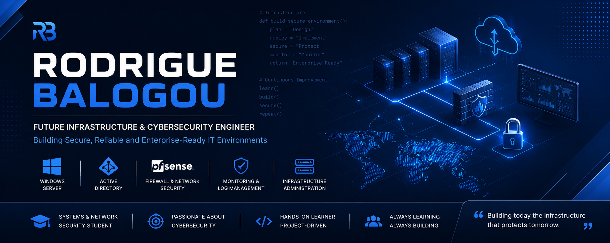

  

<h3 align="center">Infrastructure & Cybersecurity Engineer in Training</h3>

  Building, securing and documenting enterprise IT infrastructures through hands-on projects.

---

## About Me

I'm a Systems & Network Security student focused on **IT infrastructure, networking and cybersecurity**.

I build realistic laboratory environments to develop practical skills in **Windows Server, Active Directory, network security, monitoring and infrastructure administration**.

My goal is to grow into an **Infrastructure & Cybersecurity Engineer**, with a strong focus on secure and reliable enterprise environments.

Currently seeking an **internship opportunity** in Infrastructure, Systems, Networking or Cybersecurity.

---

## Core Skills

**Infrastructure**

* Windows Server
* Active Directory
* DNS / DHCP
* Group Policy (GPO)
* File Server Administration

**Networking & Security**

* TCP/IP
* VLAN & Network Segmentation
* Routing & NAT
* DMZ
* pfSense
* Windows Hardening
* Access Control
* Security Monitoring

**Monitoring & Logging**

* Windows Event Forwarding (WEF)
* NXLog
* Zabbix
* Suricata

**Development**

* Python
* PHP
* HTML / CSS
* JavaScript
* Tailwind CSS
* Bootstrap

**Tools**

* VMware Workstation
* VirtualBox
* Git / GitHub
* VS Code
* Draw.io
* Kali Linux
* Nmap
* Metasploit
* Burp Suite

---

## Featured Projects

### Enterprise Security Lab

Enterprise-style infrastructure lab combining:

**pfSense · Active Directory · Windows Server · Network Segmentation · GPO · WEF · NXLog · Monitoring · Hardening**

Designed to simulate realistic enterprise infrastructure and security scenarios.

### Planify

Event management web application built with **PHP, HTML, CSS and JavaScript**, including event management, ticket booking and online payments through Fedapay.

### Active Directory Administration Lab

Hands-on Windows Server environment covering **Active Directory, DNS, DHCP, Organizational Units, Group Policy and user administration**.

---

## Currently Learning

* Proxmox VE
* Microsoft Azure
* Microsoft Sentinel
* Wazuh
* Infrastructure Automation
* Detection Engineering
* Incident Response

---

## Career Focus

**Infrastructure · Systems Administration · Networking · Cybersecurity · SOC Operations**

I'm interested in building secure, maintainable and well-documented IT environments while continuously developing my technical expertise.

---

## Let's Connect

Open to **internships, technical collaborations and infrastructure & cybersecurity projects**.

> **Building secure infrastructures through practice, curiosity and continuous learning.**
